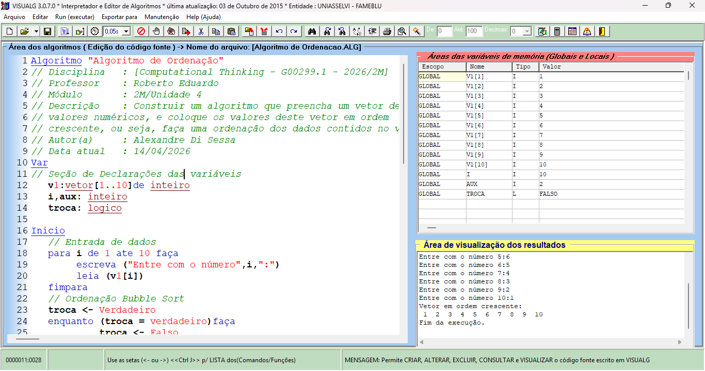

# OrdenacaoBubble
Algoritmo de Ordenação (Bubble Sort) — vetor[1..10]  
Construir um algoritmo que preencha um vetor de tamanho 10 com valores numéricos e coloque os valores deste vetor em ordem crescente. Implementação didática em Java (e referência em Visualg) com foco em ensino: entrada interativa, ordenação in‑place usando Bubble Sort com flag de controle (troca) e saída formatada.



## Estrutura do projeto

- `pom.xml` - arquivo de configuração Maven
- `src/main/java/com/example/ordenacao/OrdenacaoBubble.java` - código-fonte Java

## Como executar

```
Este projeto utiliza Maven para compilar e rodar o algoritmo Bubble Sort em Java.

Após clonar ou fazer fork do repositório, basta rodar o script:

bash
./run.sh

Exemplo de execução:
O programa irá solicitar que você digite 10 números e, ao final, exibirá o vetor em ordem crescente.

Entre com o número 1: 123
Entre com o número 2: 654
...
Entre com o número 10: 943

Vetor em ordem crescente:
123 156 189 357 654 753 789 943 951 987

```